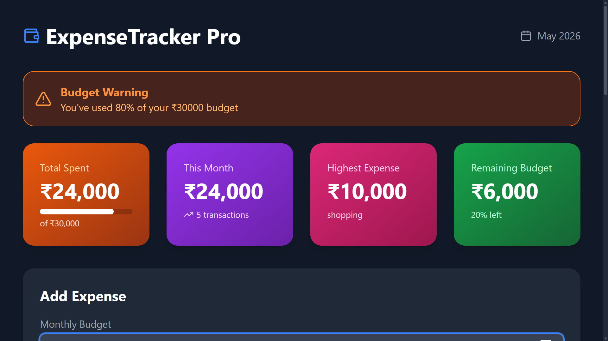
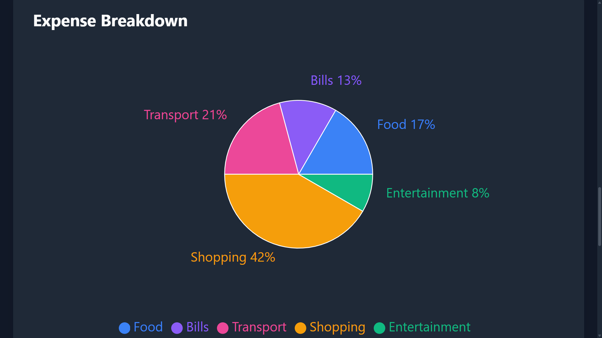
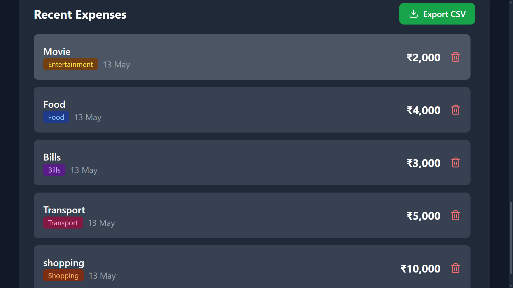

# ExpenseTracker Pro 💎

Modern expense tracker built with React + Tailwind CSS + Recharts

## 🚀 Live Demo
[View Live Project](https://expense-tracker-pro-tau.vercel.app/) 

## 📸 Screenshots

### 1. Dashboard with Budget Alert System

Real-time budget tracking with conditional warning at 80% threshold

### 2. Interactive Expense Breakdown Chart

Category-wise visualization using Recharts with responsive design

### 3. Recent Expenses with CSV Export

Add/Delete expenses with date tracking and one-click CSV export

## ✨ Key Features
- 🚨 **Smart Budget Alerts** - Orange warning at 80%, Red alert at 100% budget usage
- 📊 **Live Pie Chart** - Category-wise breakdown with percentage labels
- 💾 **Local Storage** - Data persists after browser refresh
- 📥 **CSV Export** - Download all expenses for Excel/Google Sheets
- 🔔 **Toast Notifications** - Success/Error feedback for all actions  
- 📅 **Date Tracking** - Add expense with custom date selection
- 📱 **Responsive UI** - Dark theme works on mobile & desktop
- 🎨 **6 Categories** - Food, Bills, Transport, Shopping, Health, Entertainment

## 🛠️ Tech Stack
| Technology | Usage |
| --- | --- |
| **React 18** | Core framework with Hooks |
| **Vite** | Build tool & dev server |
| **Tailwind CSS** | Styling & responsive design |
| **Recharts** | Data visualization |
| **Lucide React** | Icon library |
| **Vercel** | Deployment & hosting |

## ⚡ Run Locally
```bash
git clone https://github.com/akash1234-design/expense-tracker-pro.git
cd expense-tracker-pro
npm install
npm run dev
